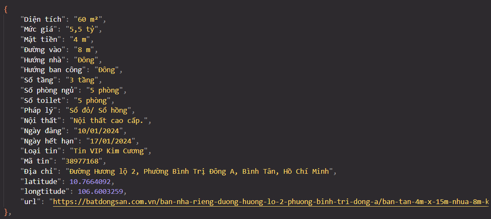
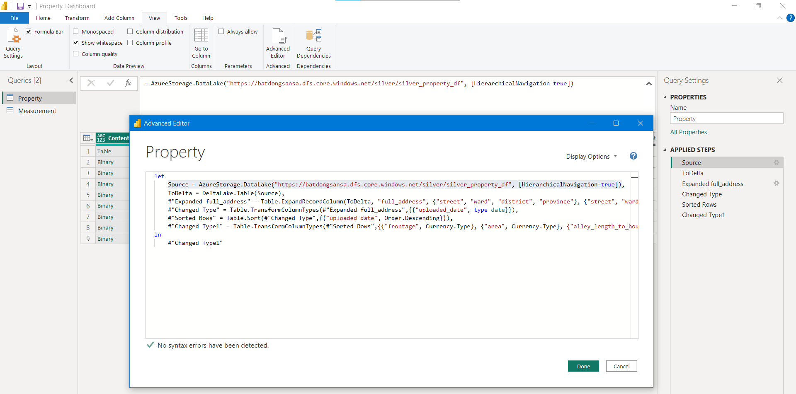
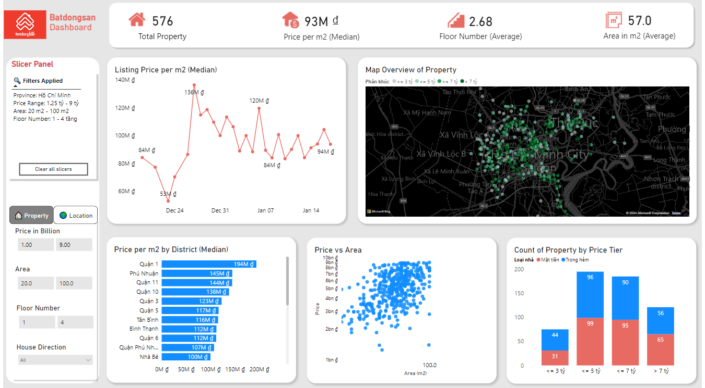
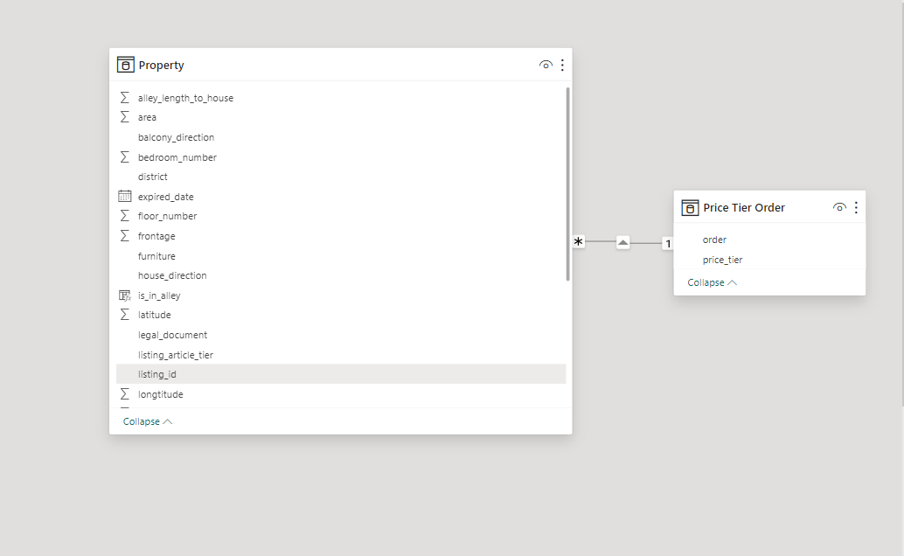
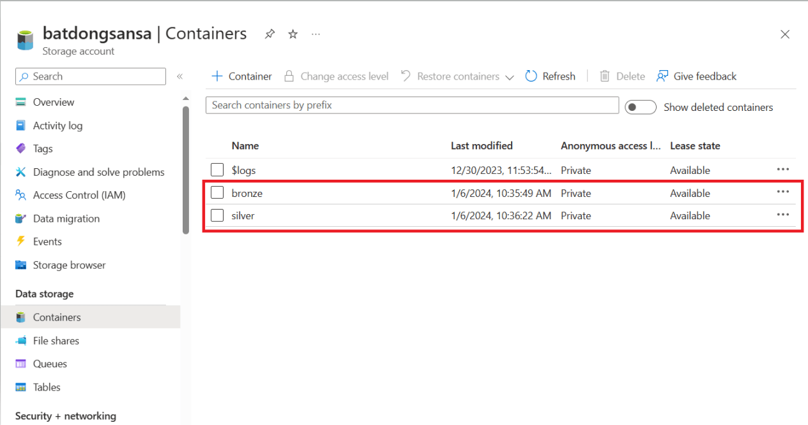
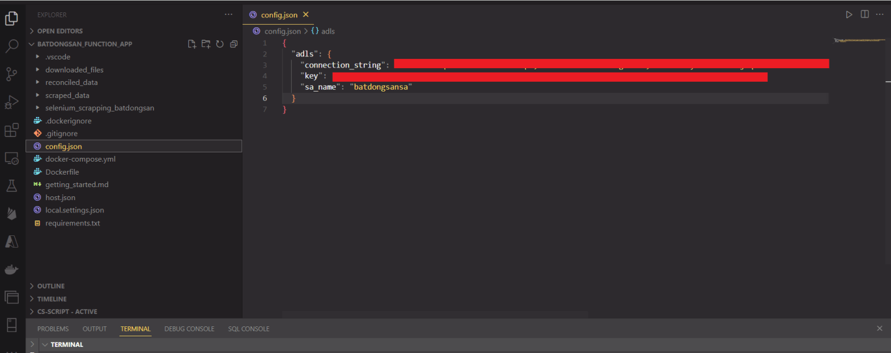
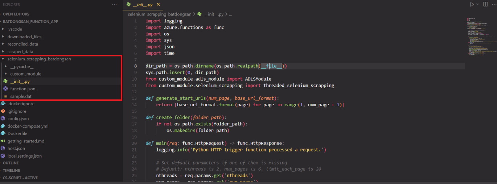
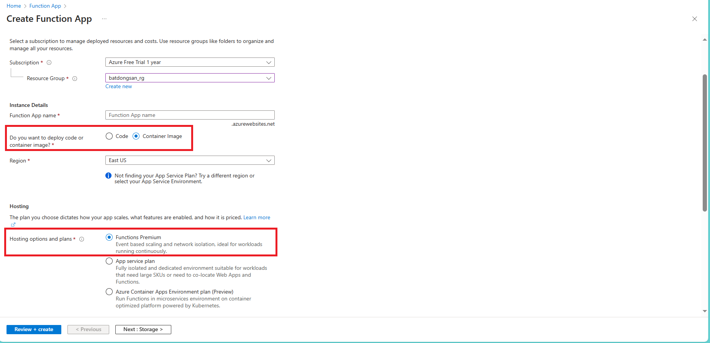
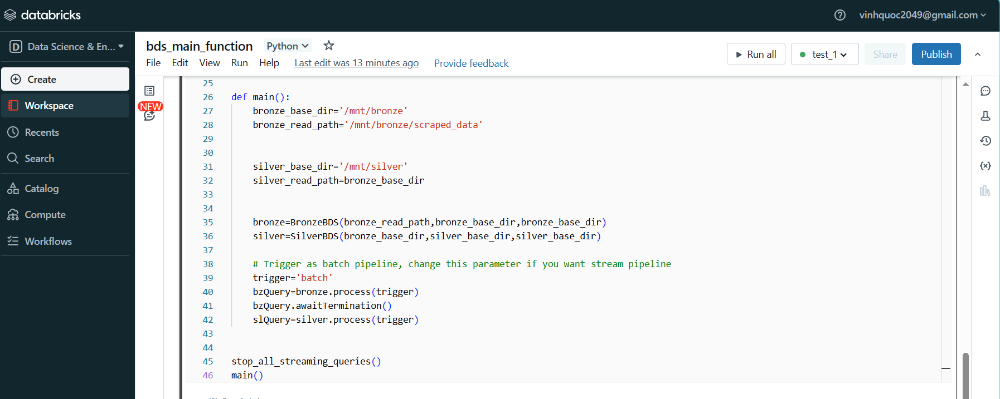

# [Real Estate Scrapping](https://batdongsan.com.vn/) Data Pipeline
<!-- Start Document Outline -->

<!-- End Document Outline -->
## Problem and Objective
- During a research process for building  [Tokenized Real Estate Trading Exchange](https://github.com/VinhQuocTran/Finalterm-Real-Estate-Blockchain) in my Blockchain university class, I stumbled on an article and it really caught my attention because the title [Purchasing a house in Vietnam is an uphill battle - VnExpress International](https://e.vnexpress.net/news/readers-views/purchasing-a-house-in-vietnam-is-an-uphill-battle-4547223.html). The article states that 
> **"The average income of Vietnamese is just over $3,000 a year. Thus, it will take us more than <u>160 years-worth of income to purchase a house.</u>"**
- As a "most rational Reddit user", I rarely believe in any newspaper unless it is backed by number, otherwise I will have to gather data and do due diligence for myself. 
- So I decided to take this as a learning opportunity for building web scrapping pipeline and get data ready for the analysis process.
## Architecture
The pipeline crawls data from website [Batdongsan by PropertyGuru](https://batdongsan.com.vn/) and consists of various modules and technologies
- **Microsoft Azure**: Azure Functions (crawl, extract and load data), Azure Data Lake Storage Gen2 (store raw/transformed data)
- **Docker**: Containerize source code folder and deploy the image to Azure Functions for auto-scaling crawler
- **Spark Structure Streaming**: a data processing framework help to unify both of your batch and streaming pipeline without rewriting code  
- **Databricks**: a big data platform that allows me run Spark Structure Streaming without setting up infrastructure on my own.
- **PowerBI**: BI tool to help connect and get data from Delta Table using Power Query and create dashboard for analysis
- **Prefect**: An orchestration tool

### Overview
- The [Batdongsan by PropertyGuru](https://batdongsan.com.vn/)  multi-threaded crawler is written in Azure Functions and can be containerized to deploy as an image to Azure for auto-scaling
- The extracted data from the crawler is directly stored to  containers in Azure Data Lake Storage (ADLS). **The whole data pipeline starts running when you trigger the HTTP of your `selenium_scrapping_batdongsan` Azure Function**
### ETL Flow
- You trigger HTTP of `selenium_scrapping_batdongsan` Azure function to start a pipeline. The crawler scrapes all properties's information in each page, all needed parameters are: 
    - **nthreads**: set number of threads do you want, each thread is a Selenium Chrome browser (i.e: If you set 3 threads then you have 3 Selenium Chrome browser scrapping concurrently)
    - **num_pages** determines how many pages you want to scrape
    - **limit_each_page** determines how many properties you want to scrape in each page (max and default is 20)
    - **base_url_format**: base URL of [Batdongsan ](https://batdongsan.com.vn/) website you want to crawl (Ex: https://batdongsan.com.vn/ban-nha-rieng-tp-hcm)
- Raw data saved as json file and uploaded to `Bronze` container in ADLS Gen2

- After the scrapping process finished, the `bds_main_function` notebook in Databricks will ingest data from bronze container and create **Bronze Delta Table**. Then data is transformed/deduplicated and load to **Silver Delta Table** in `Silver` container
- Finally, Using Power Query from PowerBI to directly load data from Delta Table and create dashboard

### Data Modeling and PowerBI Dashboard
- Unlike my previous project [BoardgameGeek Data Pipeline ](https://github.com/VinhQuocTran/Boardgamegeek-ETL-Pipeline), We use only OBT (One Big Table) for this one because the dataset is small, and there is no need for Kimball/Inmon data modeling techniques

## How to run
### Set up the crawler

Install the modules belows
- **Docker Desktop and Docker Engine** for running container
- **VS Code and extensions** for locally debug and run code: Azure Account, Azure Function, Azure Resources
- **Postman** for sending API request

#### Create Azure resources
Create all resources below to prepare for the data pipeline
- 1 Azure Data Lake Storage account Gen 2 (ADLS) and 2 containers for our data layer: bronze, silver

#### Create `config.json` in `src/batdongsan_function_app`  and put your credentials to access Azure resources
- If you want to upload raw data to ADLS containers, you have to set up your credentials like ADLS connection string, key, name (*)
- (*) This step is optional if you just want to crawl data and do not run the pipeline in Databricks, scraped data will be saved to `scraped_data` local folder

- Azure Functions Overview: Every Azure function folder will have the structure like the image below
    - `__init__.py` contains main code to execute
    - `function.json` contains a function's settings include **binding**/**trigger**

#### Test and debug our data pipeline
- Follow the path `src/batdongsan_function_app` inside repo and open folder using VS code, then press F5 and run Postman to test the crawler

- Another way to do is running `docker compose up -build`, go to Postman and run this URL, then pass 4 needed parameters
> http://localhost:9090/api/selenium_scrapping_batdongsan

=> After you've done with debug and testing, just use `docker build` and `docker push` to create and push the image to Docker or Azure ACR
#### Deploy the crawler in Azure Functions
- Go to Azure Portal and deploy your crawler as an image in Azure Functions App. Now you can use HTTP protocol to call the crawler

### Set up Databricks
Upload 3 python notebooks in path `src/databrick_notebook` to your Databricks workspace
- `bds_streaming_pipeline` includes Bronze and Silver class for the data pipeline
- `bds_test_suite` for debugging and testing purpose
- `bds_main_function` entry to run connect to ADLS and run the data pipeline

