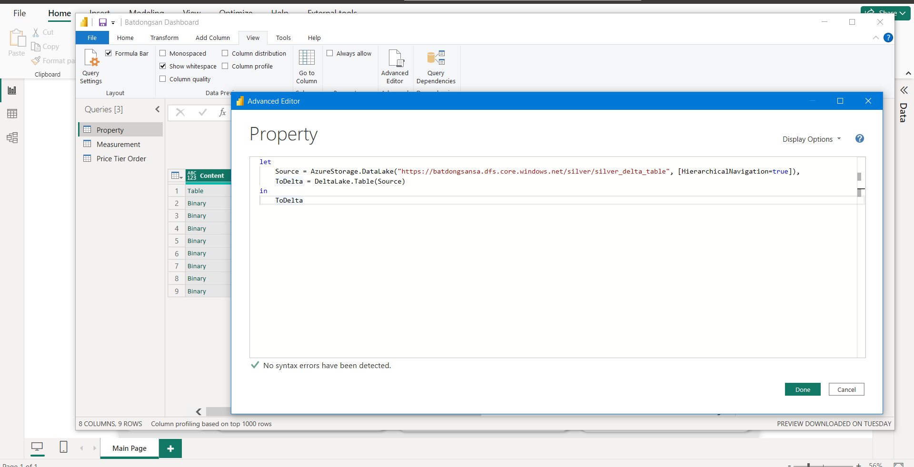

# [Real Estate Scraping](https://batdongsan.com.vn/) Data Pipeline
<!-- Start Document Outline -->

* Real Estate Scrapping Data Pipeline
	* [Problem and Objective](#problem-and-objective)
	* [Architecture](#architecture)
		* [Overview](#overview)
		* [ETL Flow](#etl-flow)
		* [Data Modeling and PowerBI Dashboard](#data-modeling-and-powerbi-dashboard)
	* [How to run](#how-to-run)
		* [Set up the crawler](#set-up-the-crawler)
			* [Create Azure resources](#create-azure-resources)
			* [Set up ADLS credentials](#set-up-adls-credentials)
			* [Test and debug our data pipeline](#test-and-debug-our-data-pipeline)
			* [Deploy the crawler in Azure Functions](#deploy-the-crawler-in-azure-functions)
		* [Set up Databricks](#set-up-databricks)

<!-- End Document Outline -->
## Problem and Objective
- During my research process for developing the  [Tokenized Real Estate Trading Exchange](https://github.com/VinhQuocTran/Finalterm-Real-Estate-Blockchain) as part of my Blockchain university class, I stumbled on an article that captured my attention. The article, titled ["Purchasing a house in Vietnam is an uphill battle - VnExpress International"](https://e.vnexpress.net/news/readers-views/purchasing-a-house-in-vietnam-is-an-uphill-battle-4547223.html) highlighted the challenges associated with buying a house in Vietnam. According to the article:
> **"The average income of Vietnamese is just over $3,000 a year. Thus, it will take us more than <u>160 years-worth of income to purchase a house.</u>"**
- As a "most rational Reddit user", I rarely believe in any newspaper unless it is backed by number. Otherwise, I find it necessary to gather data and do due diligence for myself. 
- So I decided to take this as a learning opportunity for building a web scraping pipeline and getting data ready for the analysis process.
## Architecture
The pipeline crawls data from website [Batdongsan by PropertyGuru](https://batdongsan.com.vn/) and consists of various modules and technologies
- **Microsoft Azure**: Azure Functions (crawl, extract and load data), Azure Data Lake Storage Gen2 (store raw/transformed data)
- **Docker**: Containerizes the source code folder and deploy the image to Azure Functions for auto-scaling crawler
- **Spark Structure Streaming**: a data processing framework that helps to unify both of your batch and streaming pipelines without rewriting code  
- **Databricks**: a big data platform allows me to run Spark Structure Streaming and use Delta Lake architecture without having to set up infrastructure on my own.
- **PowerBI**: a BI tool to load data from Delta Table using Power Query and create dashboard for the analysis
- **Prefect**: An orchestration tool

### Overview
- The [Batdongsan by PropertyGuru](https://batdongsan.com.vn/)  multi-threaded crawler is implemented in Azure Functions and can be containerized to deploy as an image to Azure for auto-scaling
- The extracted data from the crawler is directly stored to containers in ADLS.
- Databricks connects to ADLS and runs Spark Structure Streaming jobs to transform data
- **The entire data pipeline starts running when you trigger the HTTP of your `selenium_scrapping_batdongsan` Azure Function**

### ETL Flow
- You trigger a HTTP of `selenium_scrapping_batdongsan` Azure Function to start the pipeline. The crawler scrapes all properties's information in each page. All required parameters are: 
    - **nthreads:** sets the number of threads you want, each thread is a Selenium Chrome browser (i.e: if you set 3 threads, you will have 3 Selenium Chrome browser scraping concurrently)
    - **num_pages:** determines how many pages you want to scrape
    - **limit_each_page:** determines the number of properties you want to scrape in each page (maximum and default is 20)
    - **base_url_format:** specifies a base URL of the [Batdongsan ](https://batdongsan.com.vn/) website you want to crawl (ex: https://batdongsan.com.vn/ban-nha-rieng-tp-hcm)
- Raw data saved as a json file and uploaded to a `Bronze` container in ADLS

- After a scrapping process finished, the `bds_main_function` notebook in Databricks will ingest data from a bronze container and create a **Bronze Delta Table**. Raw data is then transformed, deduplicated, and loaded into a **Silver Delta Table** in a `Silver` container
- Finally, use Power Query in PowerBI to directly load data from the Silver Delta Table and create a dashboard

### Data Modeling and PowerBI Dashboard
- Unlike my previous project [BoardgameGeek Data Pipeline ](https://github.com/VinhQuocTran/Boardgamegeek-ETL-Pipeline), We use only OBT (One Big Table) for this one because the dataset is small, and there is no need for Kimball/Inmon data modeling techniques

## How to run
### Set up the crawler

Install the modules belows
- **Docker Desktop and Docker Engine** for running container
- **Azure Core Function Tool** 
- **VS Code and extensions** for locally debug and testing: Azure Account, Azure Function, Azure Resources
- **Postman** for sending API request
- All libraries in `src/batdongsan_function_app/requirement.txt`

#### Create Azure resources
Create all resources below to prepare for the data pipeline
- 1 ADLS Gen2 and 2 containers for our data layer: bronze, silver

#### Set up ADLS credentials
- Create `config.json` in `src/batdongsan_function_app` and put your credentials to access Azure resources
- If you want to upload raw data to ADLS containers, remember to set up credentials like ADLS storage's name, connection string and key. Otherwise, scraped data will be saved to the local folder `scraped_data`

- Azure Functions Overview: Every Azure Function folder will have the structure like the image below
    - `__init__.py` contains main code to execute
    - `function.json` contains a function's settings including **binding**/**trigger**

#### Test and debug our data pipeline
- Navigate to the `src/batdongsan_function_app` path inside the Git repo. Open the folder using VS code, install all libraries listed in `requirement.txt`, then press F5 and run Postman to test the crawler

- Another way to do this is running `docker compose up -build`. Go to Postman, paste the URL provided below and pass 4 required parameters
> http://localhost:9090/api/selenium_scrapping_batdongsan

#### Deploy the crawler in Azure Functions
- After you've done with debug and testing, use `docker build` and `docker push` to create and push the image to Docker or Azure ACR. However, remember to remove or comment out all `.write()` commands, as deployed Azure Functions will restart if any changes are made to the source folder at runtime

- Go to Azure Portal and deploy your crawler as an image in Azure Functions App. You can now use the URL to call the crawler

- It took me about 30 mins to crawl 50 pages, using EP3 SKU instance, which costs around $0.9/hour

### Set up Databricks
Upload 3 python notebooks in `src/databrick_notebook` path to your Databricks workspace
- `bds_streaming_pipeline` includes Bronze and Silver class for the data pipeline
- `bds_test_suite` for debug and testing purposes
- `bds_main_function` Serves as the entry point to connect/mount to ADLS and run the data pipeline

